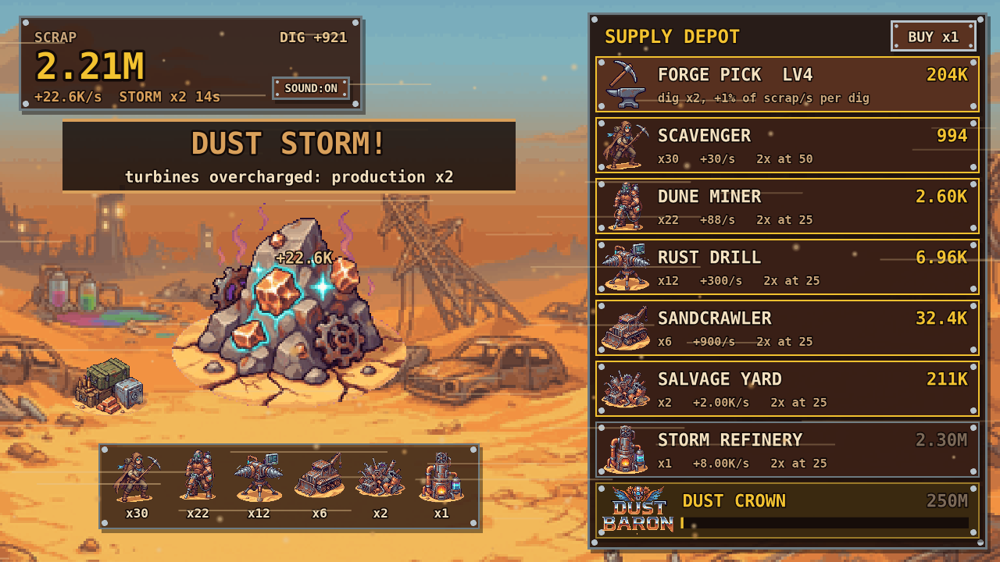

# Dust Baron

錆とクロームと砂嵐の世界で、スクラップを掘って成り上がる放置系マイニングゲーム。
[Phaser 4](https://phaser.io/) + Vite + TypeScript で作っています。



**ブラウザで遊ぶ:** https://harukats.github.io/dust-baron/
デスクトップ版(Windows / macOS / Linux)は [Releases](https://github.com/harukats/dust-baron/releases) からダウンロードできます。

## 遊び方

鉱床をクリックしてスクラップを掘り、Supply Depot でクルーや機械を雇って採掘を自動化します。
最終目標は **Dust Crown**(2億5000万スクラップ)の購入です。クリア後もそのまま続けて遊べます。

| 操作 | 内容 |
|---|---|
| 鉱床をクリック / `Space` | 掘る |
| ショップの行をクリック | 購入 |
| `BUY x1` ボタン / `Q` | 購入数を切り替え(x1 → x10 → MAX) |
| `SOUND` ボタン / `M` | ミュート切り替え |

- **Forge Pick**:レベルが1上がるごとに、1回の掘削量が2倍になり、毎秒生産量の1%ぶんも上乗せされます。
- **クルーと機械(6段階)**:Scavenger → Dune Miner → Rust Drill → Sandcrawler → Salvage Yard → Storm Refinery。25・50・100…台そろえるごとに、その種類の生産量が2倍になります。
- **砂嵐**:70〜110秒ごとに発生し、15秒間生産量が2倍になります。
- **クロームキャッシュ**:ときどき出現する箱です。クリックすると大量のスクラップか、20秒間の掘削7倍のどちらかが手に入ります。
- **セーブ**:5秒ごとと購入時にブラウザの `localStorage` へ自動保存します。離れていた時間も、半分の速度で最大2時間分を採掘します。

## 開発

### 必要なもの

- Node.js 22.18 以上。テストは Node が `.ts` を直接実行する機能を使います。開発時は 26 で動作を確認しています。
- pnpm。バージョンは `package.json` の `packageManager` で固定しています。

### セットアップ

```sh
pnpm install
pnpm dev        # http://localhost:8080
```

### コマンド

| コマンド | 内容 |
|---|---|
| `pnpm dev` | 開発サーバー(ホットリロードあり) |
| `pnpm build` | 型チェック → テスト → `dist/` へビルド |
| `pnpm preview` | ビルド結果を確認用に配信 |
| `pnpm test` | 経済ロジックのテスト(`node:test`) |
| `pnpm typecheck` | TypeScript の型チェック |
| `pnpm lint` / `pnpm lint:fix` | [Biome](https://biomejs.dev/) によるフォーマット・Lint のチェック / 自動修正 |

`dist/` は相対パスで出力されるので、そのまま任意の静的ホスティングに置けます。

### デスクトップ版(Tauri)

[Tauri 2](https://v2.tauri.app/) でデスクトップアプリとしても動かせます。設定は `src-tauri/` にあります。
事前に [Rust](https://rustup.rs/) と、OS ごとの[依存パッケージ](https://v2.tauri.app/start/prerequisites/)が必要です
(Windows は WebView2 と MSVC Build Tools、Linux は `libwebkit2gtk-4.1-dev` など)。

| コマンド | 内容 |
|---|---|
| `pnpm tauri dev` | Vite 開発サーバーを起動し、デスクトップウィンドウで開く |
| `pnpm tauri build` | `pnpm build` のあと、インストーラーを `src-tauri/target/release/bundle/` に出力 |

セーブはブラウザ版と同じく `localStorage` ですが、保存先は WebView のアプリ用領域になるため、ブラウザ版とは共有されません。
Windows 向けには 2 種類のインストーラーがあります。`*-setup.exe` はユーザー単位のインストールで、管理者権限は要りません。`*.msi` は全ユーザー向けに `Program Files` へインストールするもので、管理者権限が必要です。
インストーラーは未署名なので、初回起動時に Windows の SmartScreen や macOS の Gatekeeper の警告が出ます。

### リリース

Web 版とデスクトップ版は、GitHub Actions の `Release` ワークフロー(`.github/workflows/release.yml`)で同時にリリースします。
`main` は保護されているので、`version` の変更も PR でマージします。

1. ブランチで `package.json` の `version` を上げ、PR を作ってマージします。
2. マージ後の `main` で、同じ番号のタグを push します。

```sh
git switch main && git pull
git tag v0.2.0 && git push origin v0.2.0
```

ワークフローは、次のように進みます。

1. Windows・macOS・Linux 向けのバンドルをビルドします。タグと `version` が一致しないときは、ビルド前に失敗します。
2. 3 OS ともビルドに成功すると、GitHub Releases にリリースノート付きで公開します。
3. 続けて Web 版をビルドし、[GitHub Pages](https://harukats.github.io/dust-baron/) を更新します。

`v0.2.0-beta.1` のようにハイフンを含むタグは pre-release になり、GitHub Pages は更新しません。
`v*` のタグは保護されていて、一度 push したタグは削除も付け替えもできません。番号を間違えたときは、次の番号で出し直してください。

ワークフローは手動でも実行できます(`gh workflow run release.yml`)。

| 実行方法 | 内容 |
|---|---|
| 入力なし | デスクトップ版のバンドルをビルドし、ワークフローの成果物に置くだけ(公開はしない) |
| `-f pages_tag=v0.1.0` のように入力 | バンドルは作らず、そのタグの内容で GitHub Pages だけを公開し直す |

Web 版のセーブは `harukats.github.io` の `localStorage` に保存されます。ローカルの開発環境やデスクトップ版のセーブとは別です。

### 構成

```
src/
  config.ts, economy.ts, storage.ts   # ゲームの数値・ルール・セーブ(Phaser に依存しない)
  economy.test.ts                     # 上記のテスト
  scenes/                             # Boot → Preloader → Title → Game → Victory
  ShopRow.ts, ui.ts, sfx.ts           # UI 部品と、WebAudio で合成する効果音
public/assets/                        # 画像と BGM
public/                               # Web 版のアイコン(favicon.ico, apple-touch-icon.png)
src-tauri/                            # Tauri のデスクトップ版(設定・アイコン・Rust のエントリポイント)
```

ゲームのルールは Phaser から切り離した純粋な関数として書いており、ブラウザなしでテストできます。
設計の詳細や Phaser 4 での注意点は [CLAUDE.md](CLAUDE.md) にまとめています。

## アセット

`public/assets/` の画像(ピクセルアート)と BGM(チップチューン)は、Phaser Game Agent の生成機能で作成したものです。
効果音は `src/sfx.ts` で WebAudio を使って合成しています。

## ライセンス

ソースコードとアセットはすべて [MIT License](LICENSE) で公開しています。
アセットには、`public/assets/` の画像と BGM、`docs/screenshot.png`、アプリのアイコン(`public/favicon.ico`、`public/apple-touch-icon.png`、`src-tauri/app-icon.png`、`src-tauri/icons/`)が含まれます。
