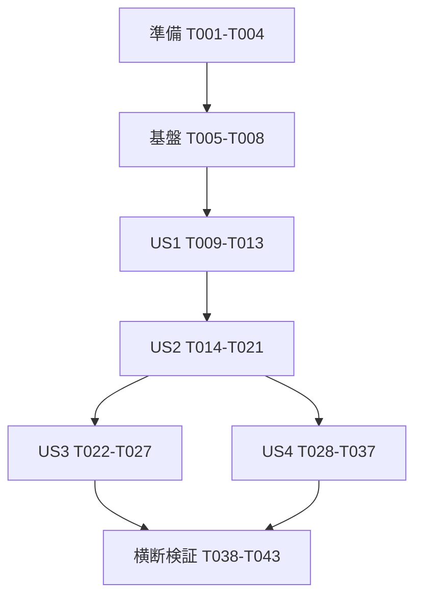

# タスク: Mine Clicker — 砂漠の採掘と自動化

**入力**: `specs/001-mine-clicker/` の設計文書。
**前提**: [計画](plan.md)、[仕様](spec.md)、[調査](research.md)、[データモデル](data-model.md)、[契約](contracts/ui.md)、[検証ガイド](quickstart.md)、`.specify/memory/constitution.md`。
**検証方針**: 仕様の受け入れシナリオとSC-001〜013、憲章の検証規則に基づいて必要なテストを含める。既存の仕様適合箇所は再実装せず検証・再利用する。
**構成**: 4つのユーザーストーリーごとに実装と独立検証をまとめる。全タスクは未完了から開始する。

## 形式: `T番号 [P任意] [US番号] 作業とファイルパス`

- `[P]` は、記載された先行タスクの完了後、別ファイルの作業と並行可能であることを表す。
- `[US1]`〜`[US4]` は仕様の同番号ストーリーへ対応する。セットアップ・基盤・仕上げには付けない。
- 新機能や不具合の検証は実装前に用意し、未実装の結果を確認する。既存適合機能のテストは成功することを確認し、失敗を作るために既存コードを壊さない。
- 日本語の文書・報告と英語UIを維持する。完了チェックは実際の完了・合格後だけ付ける。

## パスの規則

単一プロジェクトのルート相対パスを使う。ソースは `src/`、ブラウザ検証は `tests/e2e/`、検証記録は `specs/001-mine-clicker/validation.md`、性能記録は `specs/001-mine-clicker/performance.md` に配置する。
同じ記録ファイルへの更新も競合するため、記録タスクは並行実行しない。

## フェーズ1: セットアップ（共通の準備）

**目的**: 既存構成を維持したまま、差分と検証環境を確定する。

- [X] T001 `src/config.ts`、`src/economy.ts`、`src/storage.ts`、`src/scenes/` と設計を照合し、FR-001〜018・SC-001〜013の現状差分と検証担当タスクを `specs/001-mine-clicker/validation.md` に記録する。既存適合機能を再利用対象として区別する。
- [X] T002 `package.json` と `pnpm-lock.yaml` に安定版 `@playwright/test` の開発依存と `test:e2e` を追加する。既存 `test`・`build` と packageManager を維持し、実行時依存は増やさない。
- [X] T003 T002後に `playwright.config.ts` と `tests/e2e/helpers.ts` を作成し、localhost:8080、Vite起動時のブラウザ自動表示抑止、同一Context複数page、独立した保存fixture、dev限定window.gameの取得を設定する。`src/**/*.test.ts` のNodeテストへE2Eを混入させない。
- [X] T004 T003後・実行時コード変更前に `tests/e2e/performance-probe.ts` を用意し、計画の固定環境・10秒ウォームアップ・60秒測定・3試行・通常/一時効果負荷の基準値を `specs/001-mine-clicker/performance.md` に記録する。基準コミット、OS、CPU、ブラウザ完全版、GPU、DPR、入力反応とFPSを記録し、最終比較も同じ計測器・環境を使う。

## フェーズ2: 基盤（全ストーリーの先行条件）

**目的**: 保存先の単一所有者を決め、全操作を安全に開始できるようにする。

- [X] T005 `tests/e2e/session-base.spec.ts` に起動時競合の先行検証を追加する。同じContextの後続pageではPhaser起動・保存読込/書込/削除が0回、別Contextでは独立起動、API非対応/取得例外では保存なしの英語案内と新規一時プレイを確認する。既存保存fixtureがあっても読込/書込/削除と離席収入が0件、一時プレイ中の採掘・雇用・自動生産・強化が可能で、競合結果では一時プレイを開始しないことを確認する（FR-015・018、SC-013）。
- [X] T006 T005後に `src/session.ts` を実装し、`acquiring / owned / blocked / ephemeral / released` の状態、ephemeralの理由（API非対応/取得例外）と `dust-baron-save-v1:play` の排他・ifAvailable取得を提供する。取得結果通知と保持Promiseを分け、signal併用・steal・待機列・期限付き横取りを使わず、モジュール読み込み時にWeb APIへアクセスしない。
- [X] T007 T006後に `src/main.ts` と `index.html` を接続し、ownedとephemeralでPhaser.Gameを生成し、ephemeralは共有保存を読まずnewStateから開始する。blockedは契約どおり `GAME ALREADY OPEN` と再開案内だけを表示する。ephemeralには `TEMPORARY PLAY — NOT SAVED` と終了時に進行が失われる説明を英語で表示する。旧ゲーム停止完了後のHMR解放と、blockedの全操作禁止・ephemeralの共有保存アクセス禁止を保証する。
- [X] T008 T007後に `src/storage.ts` のrunへ `state: State または null` と `accountedAtMs: number` を加え、`src/config.ts` に共有キー・文言を集約する。保存の読込/書込/削除をownedに限定する境界を設け、ephemeralは同じメモリ内runで操作できるようにする。ライブカーソルと成功保存日時を別に扱う。State JSONの既存フィールド名は変更しない。

**チェックポイント**: T005の検証成功。blockedは進行へアクセスせず、ephemeralは共有保存と独立した一時進行だけを操作する。シーン遷移ではプレイ権を解放しない。以降のストーリーはこの基盤を共通条件とする。

## フェーズ3: US1 — クリックして稼ぐ（優先度: P1、最小MVP）

**目標**: 英語UIと砂漠の世界観の中で、手動採掘とCredits表示を成立させる。
**独立検証**: 新規状態で10/100回クリック、Space1回、装飾クリックを行い、正確な収入と視覚反応を確認する。自動化購入は不要。

### 検証

- [X] T009 [US1] `tests/e2e/mining.spec.ts` に新規残高0・採掘量1・毎秒0、100クリックで100増加、Spaceとの同結果、repeat無視、装飾クリック無収入、主要HUDの英語表記を検証するケースを作成する（FR-001〜004、SC-002・005）。

### 実装

- [X] T010 [US1] `src/config.ts` の通貨UI文言を `Credits` / `Credits/s` に統一する定義として整理する。価格・生産量・アセットキー・6種類のGENS順序を変更しない。
- [X] T011 [P] [US1] T010後に `src/scenes/Game.ts` の鉱床入力・HUD・視覚反応をFR-002〜004に合わせ、通常採掘量1、Space1回の同結果とrepeat抑止を維持する。錆・クローム・砂漠の既存アート、対象テクスチャのNEARESTとFITを再利用する。
- [X] T012 [P] [US1] T010後に `src/scenes/Title.ts` と `src/scenes/Victory.ts` の開始・累計・達成文言を英語のCredits表記へ統一する。scrapは採掘物の説明としてだけ残し、別通貨のように表示しない。
- [X] T013 [US1] T009〜T012後に `tests/e2e/mining.spec.ts` を実行し、クリック/Space/装飾の結果と1280×720・960×540の主要操作を確認して `specs/001-mine-clicker/validation.md` にUS1の結果を記録する。

**チェックポイント**: 手動採掘を単独でデモできる。これは最小MVPであり、要求全体の完了にはUS2以降も必要。

## フェーズ4: US2 — 雇用と装置で自動化する（優先度: P1）

**目標**: Creditsを投資し、人員・装置で経過時間に応じた収入を得る。
**独立検証**: fixtureの残高15からSCAVENGERを購入し、残高0・所有数1・毎秒0.5、20秒で10±0.5、装置購入と手動採掘併用を確認する。

### 検証

- [X] T014 [P] [US2] `src/economy.test.ts` に6種類の価格・生産、価格と同額/直前、100回の不足購入で無変更、混在所有の合算、小数の蓄積、非有限の購入費用の拒否を追加または既存ケースで確認する（FR-005〜008、SC-002〜004）。
- [X] T015 [P] [US2] `src/production.test.ts` にeconomy.tsの純粋関数を対象として、固定時刻で60秒の通常生産、同時刻の再精算0、逆行時刻の収入0・カーソル非後退、購入前後の率の分離、砂嵐有効区間だけの2倍を検証するケースを作成する。
- [X] T016 [P] [US2] `tests/e2e/automation.spec.ts` に人員・装置購入、表示費用と支出、購入可否、小数収入、手動と自動の併用を検証するケースを作成する。初回雇用が1秒1クリックで30秒以内となることも確認する（SC-001・003・004）。

### 実装

- [X] T017 [US2] T014後に `src/economy.ts` の購入・合算・収入処理を検証結果に合わせて再利用または修正する。残高は「有限・非負。利用可能残高」、金額は小数を保持し、非有限な派生値で残高や所有数を壊さない。
- [X] T018 [US2] T015・T017後に `src/economy.ts` へPhaser/DOM非依存の区間精算を追加する。State・accountedAtMs・現在時刻・効果期限を引数で受け、精算結果と次のカーソルを返す。accountedAtMs以降を一度だけ100%で精算し、通常率と既存砂嵐の重なりを定数個の区間で計算する。秒数をフレーム数分反復せず、production.tsは追加しない。
- [X] T019 [US2] T017・T018後に `src/storage.ts` と `src/scenes/Game.ts` へ共通精算を接続する。updateの描画deltaと生産時間を分離し、採掘・購入・生産倍率変更・保存の前に精算して新しい率を過去へ適用しない。
- [X] T020 [US2] T019後に `src/scenes/Game.ts` と `src/ShopRow.ts` の雇用・装置行へ英語名、費用、所有数、能力、購入可否を正確に表示する。表示と購入は同じ経済式を使い、変化がない行を再描画しない。
- [X] T021 [US2] T014〜T020後にNode検証と `tests/e2e/automation.spec.ts` を実行し、SC-001〜004と独立検証の合否を `specs/001-mine-clicker/validation.md` に記録する。

**チェックポイント**: 手動採掘→最初の雇用→無操作の収入が成立する。プレイヤー向けの最初の公開候補はUS1+US2。

## フェーズ5: US3 — 投資を重ねて成り上がる（優先度: P2）

**目標**: 強化・まとめ買い・所有数倍率・Dust Crownで長期の成長を提供する。
**独立検証**: 残高・所有数を設定したfixtureから、各購入モード、強化、全倍率閾値、目標の一度だけの購入と継続を確認する。

### 検証

- [X] T022 [P] [US3] `src/economy.test.ts` に10個分不足時の無変更、合計切り上げ費用、MAXと次の1個、Forge Pickの式、25/50/100/200/300/400/500の直前・到達・直後、Dust Crownの二度目拒否を追加または既存ケースで確認する。SCAVENGER所有0で10個305（各単価切り上げの308は不採用）、残高304は無変更、残高305のMAXは10個・費用305、11個366および購入後の次の単品61が買えないことを固定値で検証する（FR-009〜012、ストーリー3-7・8）。
- [X] T023 [P] [US3] `tests/e2e/progression.spec.ts` にx1/x10/MAXとQ切替、強化表示、倍率更新、Dust Crown購入→Victory→Gameで同じ進行の継続を検証するケースを作成する。

### 実装

- [X] T024 [US3] T022後に `src/economy.ts` と `src/config.ts` のまとめ買い・強化・倍率・達成を仕様に合わせて再利用または修正する。費用は `ceil(sum(baseCost × 1.15^(owned+k)))` の合計切り上げを維持し、数量・費用・残高を一貫させる。
- [X] T025 [US3] T024後に `src/scenes/Game.ts` と `src/ShopRow.ts` へx1/x10/MAX、強化、倍率、達成済みの表示と操作を統合する。購入前精算と成功後保存を共通経路にし、部分購入や同一目標の再購入を防ぐ。
- [X] T026 [US3] T025後に `src/scenes/Victory.ts` と `src/scenes/Game.ts` の達成→継続とcrew再構築を確認・修正する。stateを再読込せず、一時状態をcreateで初期化し、旧表示に対する反復tweenと外部購読が残らないようにする。
- [X] T027 [US3] T022〜T026後に `tests/e2e/progression.spec.ts` とNode検証を実行し、全閾値・強化・達成と継続の結果を `specs/001-mine-clicker/validation.md` に記録する。

**チェックポイント**: 成長・達成・継続が前の採掘ループを壊さず機能する。

## フェーズ6: US4 — 離れても進行を引き継ぐ（優先度: P2）

**目標**: 項目別復旧、離席収入、非表示収入、単一セッション、音声と再入場を完成させる。
**独立検証**: 保存fixtureを復元し、閉じた60秒で50%収入、開いたままの60秒で100%収入、破損項目だけ初期化、後続画面の停止を確認する。

### 検証

- [X] T028 [P] [US4] `src/economy.test.ts` に残高・total・clicks・各owned・pick・won・playTime・lastSaveの不正/欠落、壊れたJSON・配列・null・既知進行項目なし、正常な旧保存の同額復元を検証するケースを追加する。制約「不正・欠落した項目は初期値へ戻す。整数項目の小数は切り捨てない。」を検証する（SC-011）。
- [X] T029 [P] [US4] `src/storage.test.ts` に保存APIを注入または呼出時だけ置換するNode検証を用意し、読込/書込/削除例外、owned以外の共有保存アクセス禁止、ephemeralのメモリ内進行維持と離席加算0、成功日時と失敗日時の区別、日時無効/未来、29/30/7200/7201秒、初回精算後の即時保存を検証する。
- [X] T030 [P] [US4] `tests/e2e/persistence.spec.ts` に保存→復元10回、加算直後の再読み込み、破損項目ごとの復元、CONTINUE判定、保存失敗でも採掘・購入継続、画面移動での二重加算なしを検証するケースを作成する（FR-013〜015、SC-006・011）。
- [X] T031 [P] [US4] `tests/e2e/session-recovery.spec.ts` に同じ保存先の後続pageで全進行停止、最初のpage閉鎖後の再読込、同時起動、非表示での権限保持、ownedのHMR・履歴復帰での再取得、復帰精算の重複防止、ephemeralのシーン移動・非表示/bfcache復帰での一時進行保持、再読み込みでの破棄と再判定、既存保存への合算なしを検証するケースを作成する（FR-015・017・018、SC-010・012・013）。

### 実装

- [X] T032 [US4] T028後に `src/economy.ts` のdeserializeを項目別復旧にする。scrap/total/playTimeは「有限・非負」、clicks/pickは「非負整数」、ownedは「GENSの順序で各種類の非負整数。種類単位で復旧」、wonは「boolean」、lastSaveは「正常な成功保存日時。0は未保存・無効の印」を適用する。rootは「null・配列ではないオブジェクトで、上記の既知進行項目を少なくとも1つ持つ必要がある」。不明項目・余剰配列要素は無視し、不足要素を0にする。
- [X] T033 [US4] T029・T032後に `src/storage.ts` の初回復元・離席精算・保存結果を実装する。ownedの保存成功時だけlastSaveを更新し、失敗でも同じライブ状態とロックを維持する。ephemeralは保存を読み書き・削除せず、離席加算も行わず、newStateから同じメモリ内進行を継続する。不正/欠落日時は現在時刻を基準として離席0、未来日時も0、正常時は復旧した生産量で50%・最大2時間を一度だけ加算し即保存する。run.stateがあるシーン再入場では再読込しない。
- [X] T034 [US4] T033後に `src/scenes/Game.ts`、`src/main.ts`、`src/session.ts` のHIDDEN/VISIBLE・pagehide/pageshow・終了を接続する。開いている間の未反映分を100%精算し、砂嵐/フレンジー/キャッシュは期限だけ適用、新規イベントを大量再生しない。非表示だけでロックを解放せず、終了は精算/保存→処理停止/購読解除→解放、ownedのbfcache復帰は再取得結果に従って再読込する。ephemeralのbfcache復帰は同じrunを保持して未精算分を100%精算し、途中でownedへ昇格させない。再読み込み時は一時進行を破棄して再判定し、共有保存へ移行・合算しない。
- [X] T035 [US4] T033後に `src/scenes/Title.ts` のCONTINUEを残高/累計だけでなく正常な所有物・強化・達成でも判定し、部分復旧した進行を保持する。ephemeralのCONTINUEは共有保存を検査せずライブrunだけから判定する。NEW RUNは既存の明示的な再確認と操作権チェックを通し、ownedは保存削除とrun/カーソルの新規化、ephemeralはメモリ内run/カーソルだけの新規化を行う。Title・Game・Victoryに契約の保存なし案内を常時表示する。
- [X] T036 [US4] T034・T035後に `src/scenes/Game.ts`、`src/scenes/Title.ts`、`src/scenes/Victory.ts`、`src/sfx.ts` のSOUND/M、BGMの一度だけの開始、購読解除、createでの一時状態初期化を検証・必要箇所のみ修正する。ゲーム全体のミュートとmaster volumeを合成効果音へ反映する経路を維持する。
- [ ] T037 [US4] T028〜T036後に保存/排他E2EとNode検証を実行し、実画面で別タブと最小化の各60秒×5回、非表示のまま通常閉鎖、シーン再入場10回、同じ保存先の別タブ/別ウィンドウ各5回を確認する。SC-006・010〜013と音声の結果を `specs/001-mine-clicker/validation.md` に記録し、強制終了/保存不能の保証限界も記載する。

**チェックポイント**: 保存・離席・背景の二重加算、正常項目の喪失、後続画面からの上書きが0件。実機未実施を合格扱いしない。

## フェーズ7: 仕上げと横断検証

**目的**: 全要求と測定結果を照合し、レビュー可能な実装にまとめる。

- [X] T038 `specs/001-mine-clicker/quickstart.md` の全UI状態を実画面で確認し、英語以外の文言0件、Creditsの一貫性、1280×720/960×540で採掘・購入・ミュート完了を `specs/001-mine-clicker/validation.md` に記録する。不備は `src/scenes/`、`src/ShopRow.ts`、`index.html` の該当箇所だけ修正する（SC-005・008）。
- [ ] T039 `tests/e2e/performance-probe.ts` でT004と同条件の実装後3試行と一時効果負荷を計測し、FPS55以上・入力反応p95が100ms以内、再入場のcanvas/BGM/購読増加0件、メモリの継続増加有無を `specs/001-mine-clicker/performance.md` に記録する。未達なら `src/economy.ts`、`src/scenes/Game.ts`、`src/ShopRow.ts` の原因を修正し該当測定を再実施する（SC-007）。
- [X] T040 `package.json` の `pnpm lint`、`pnpm typecheck`、`pnpm test`、`pnpm build`、`pnpm test:e2e` を実行し、`vite.config.ts` の相対baseで配布サブパスのアセット読込も確認して `specs/001-mine-clicker/validation.md` に結果を記録する。必須CIを無効化・迂回しない。
- [ ] T041 初見参加者5人へ英語UIだけを提示し、2分以内の初回雇用と自動収入の説明が4人以上成功することを `specs/001-mine-clicker/validation.md` に記録する（SC-009）。参加者がいない場合は未実施としてタスクを未完了に保ち、自動テストで置き換えない。参加者への外部連絡は別途明示された指示がある場合に限る。
- [ ] T042 `src-tauri/tauri.conf.json` の対象OSの実機またはRelease成果物で基本操作・Web Locks・保存復旧を確認し、`specs/001-mine-clicker/validation.md` に環境と結果を記録する。Linux WebView依存不足などで未実施の対象は未完了に保ち、Webビルド成功で代替しない。Rust依存を変更した場合だけCargo.lockと--lockedビルドも確認する。
- [X] T043 `README.md` と `specs/001-mine-clicker/quickstart.md` を実装済みの操作・英語UI・保存/排他制約・E2Eコマンドに合わせて日本語で更新し、`specs/001-mine-clicker/validation.md` のFR/SC対応表を全件再確認する。既存の文書・バージョン・配布規則を維持し、未合格項目があれば未完了としてレビューへ明示する。

## 依存関係と実行順

### フェーズの依存関係

US2は残高fixtureから独立検証できるが、同じGame.tsの統合変更を避けるためUS1完了後に実装する。
US3とUS4はUS2の生産経路を使う。同じeconomy.ts・Game.ts・storage.tsに触れる実装は直列化し、推奨順はUS3→US4とする。各ストーリーのテスト作成は別ファイルなら、対応する基盤完了後に先行できる。

### フェーズ内の依存関係

- T001→T002→T003→T004→T005→T006→T007→T008。
- US1: T009→T010→{T011,T012}→T013。
- US2: {T014,T015,T016}を先行。T014→T017、{T015,T017}→T018→T019→T020、全件→T021。
- US3: {T022,T023}→T024→T025→T026→T027。
- US4: {T028,T029,T030,T031}を先行。T028→T032、{T029,T032}→T033、T033→{T034,T035}、{T034,T035}→T036、全件→T037。T034/T035は購読と遷移の統合確認を共有するため[P]指定せず順に進める。
- 仕上げ: T038→T039→T040→T041→T042→T043。同じ記録ファイルへの更新を直列化する。性能修正があった場合は関連する自動検証もT040で実施する。

### 要求からタスクへの対応

| 要求 | 主な実装・検証タスク |
| --- | --- |
| FR-001、SC-005 | T010〜T013、T038 |
| FR-002 | T011、T013、T038 |
| FR-003、FR-004、SC-002 | T009〜T013、T014 |
| FR-005〜008、SC-001・003・004 | T014〜T021 |
| FR-009〜012 | T022〜T027 |
| FR-013、SC-006 | T029・T030・T033・T035・T037 |
| FR-014 | T029・T030・T033・T037 |
| FR-015、SC-011 | T005〜T008・T028〜T035・T037 |
| FR-016 | T036〜T038 |
| FR-017、SC-010 | T015・T018・T019・T031・T034・T037 |
| FR-018、SC-012 | T005〜T008・T031・T034・T037 |
| SC-007 | T004・T039 |
| SC-008 | T013・T038 |
| SC-009 | T041 |
| SC-013 | T005〜T008・T029・T031・T033〜T035・T037 |

## 並行実行例: US1

T010完了後、T011のGame.tsとT012のTitle.ts/Victory.tsを並行して編集できる。T013の記録は両方の完了後に行う。

## 並行実行例: US2

T014のeconomy.test.ts、T015のproduction.test.ts、T016のautomation.spec.tsは別ファイルなので並行作成できる。
T017とT018は同じeconomy.tsを変更するため直列化する。T018はT015・T017完了後に実装し、T019の接続はT018完了を待つ。

## 並行実行例: US3

T022の純粋経済テストとT023の実ブラウザテストを並行作成できる。実装は共有ファイルと時刻精算の整合を保つためT024→T025→T026の順に行う。

## 並行実行例: US4

T028のeconomy.test.ts、T029のstorage.test.ts、T030のpersistence.spec.ts、T031のsession-recovery.spec.tsを並行作成できる。
fixtureやhelpersの契約はT003で確定し、各テスト作成でhelpers.tsを同時編集しない。復旧・購読・セッションの実装統合は直列化する。

## 実装戦略

### 最小MVP

準備と基盤、US1を完了して手動採掘・英語HUDを独立検証する。デモ可能な区切りとして扱い、ユーザー要求全体の完了とはしない。

### 段階的な完成

US2を加えて手動→投資→放置収入の中核を完成させ、US3で成長と達成、US4で復旧と背景・離席を完成させる。
各チェックポイントで前段の回帰を確認し、最後に性能・初見・Desktop・配布条件を照合する。
外部公開、PR作成、マージ、リリースタグ付け、デプロイは本タスク一覧の自動実行対象に含めない。

### 複数担当者で進める場合

[P]で示した別ファイルの作業を分担できる。economy.ts、Game.ts、storage.ts、main.tsと検証記録の同時編集は避ける。
担当者を増やすだけで全ストーリーを同時実装せず、共通基盤と明示した依存を先に完了する。

## 注記

- 実装と検証の進行に合わせてチェック状態を更新する。完了の根拠と未確認の条件はvalidation.md・performance.mdに記録する。
- データモデルの型・検証制約はT017・T028・T032に記載し、実装時に別の復旧方針を選ばない。
- API非対応・保存不能・強制終了・参加者不足・Desktop依存不足は区別して記録する。完了していない検証をチェック済みにしない。
- 設計の矛盾や要件変更が必要になった場合は該当文書と理由を確認し、実装の都合だけで受け入れ条件を下げない。
