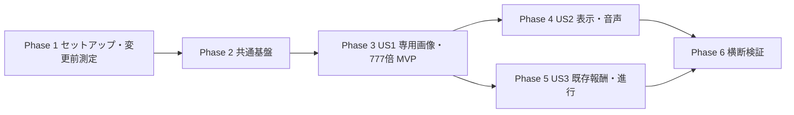

# Tasks: ゴールド・キャッシュによる採掘777倍

**入力**: `specs/004-add-gold-cache/` の [spec.md](spec.md)、[plan.md](plan.md)、[research.md](research.md)、[data-model.md](data-model.md)、[contracts/](contracts/)、[quickstart.md](quickstart.md)。

**前提**: 既存プロジェクトを拡張する。新規依存・セーブ移行は不要。ゲームルールのVitestと操作・表示のブラウザ検証はプロジェクト憲章により必須。各ストーリーの検証を先に定義し、対応実装後に実行する。

**形式**: `- [ ] T番号 [P任意] [US番号任意] 作業とファイルパス`。[P]は記載した前提完了後、別ファイルの作業と並行できることを示す。同じファイルの編集は直列に行う。各項目の完了状態はチェックボックスで記録する。

## Phase 1: セットアップ

**目的**: 既存コードを保護し、変更前の比較条件を用意する。

- [X] T001 `package.json` と `specs/004-add-gold-cache/plan.md` の前提を確認し、必要なら `pnpm install` を実行する。Gitの作業差分を記録し、実装用ブランチを用意する。関連する画像生成・Phaserスキル、Chromium、headed表示環境を確認し、環境情報を `specs/004-add-gold-cache/validation.md` に記録する。
- [X] T002 `tests/e2e/performance-probe.ts` をplanの変更前条件へ対応させる。全設備25・pick3、1280×720・DPR1、通常と砂嵐+既存7倍+2回/秒採掘、10秒準備・60秒測定・各3回、砂嵐を15秒ごと・採掘効果を20秒ごとに再付与して維持する。開始時の付与と測定開始時の周期再同期を固定し、通常条件は両効果なしとする。追加の画像・回収条件は測定開始から10秒周期で出現・5秒後にクローム7倍報酬を回収する試験制御を用意し、操作回数・タイミングを記録する。ゲームコードを変更する前に測定し、環境・commit・差分・FPS・入力p95を `specs/004-add-gold-cache/performance-before.json` と `specs/004-add-gold-cache/validation.md` に保存する。環境上未実施なら理由を明記し、基準取得済みとは扱わない。
- [X] T003 `tests/e2e/helpers.ts` に必要なキャッシュ・一時効果のテスト用型と抽選・時刻制御の補助を追加する。DEVのwindow.gameとrun.nowを利用し、乱数制御は出現・回収の対象呼び出しだけに限定する。各試験で制御を復元し、製品向け強制出現UIを追加しない。

## Phase 2: 共通基盤

**目的**: US1〜US3で共有する種類・一時倍率・初期化を定義する。このフェーズ完了後にストーリー実装へ進む。

- [X] T004 `src/config.ts` にgold選択確率0.1、採掘倍率777、`TEX.goldCache = 'gold-cache'`、goldのPIXEL_TEXTURES登録、読みやすい金色を追加する。既存FRENZY_S=20、7倍、出現間隔とクロームの報酬係数を維持する。
- [X] T005 `src/economy.ts` に共有の型 `CacheKind = 'chrome' | 'gold'` と倍率型 `1 | 7 | 777`、`activeDigMultiplier`、`applyDigFrenzy` 相当の純粋関数を追加する。モデルの制約「初期値1」「初期値0」「有効なのは期限未満」「同時に有効な効果は1つ」を守り、倍率は1・7・777だけとする。7→777は置換、777→7は期限も維持、同倍率はnow+20秒へ更新。未知倍率・非有限時刻の防御は `data-model.md` に従う。
- [X] T006 `src/storage.ts` のrunへfrenzyMultを追加し、initializeRun/resetRunで期限と対で1・0へ初期化する。`src/storage.test.ts` のbeforeEachも倍率・期限をリセットする。永続State・serialize/deserialize・保存キーを変更せず、既存の所有権とrun.state継続を保つ。
- [X] T007 `tests/e2e/ui-check.ts` と `tests/e2e/runtime-check.ts` の旧7倍fixtureを、期限だけでなくfrenzyMult=7も設定する形へ修正する。後続のcachePickupへの改名に備えて参照箇所を整理し、現行の7倍検証が新状態モデルでも成立することを確認する。`tests/e2e/ui-check.ts` のクローム報酬検証では出現時の種類抽選もchromeへ固定し、回収時は即時報酬・7倍をそれぞれ固定する。出現種類と報酬結果を確認してから画面を保存し、乱数制御は対象呼び出し中だけ適用してfinallyで復元する。

**チェックポイント**: 一時倍率の値と期限を単一の規則で解釈でき、既存セーブとテストの前提が保たれている。

## Phase 3: US1 — 回収して採掘を加速する (P1、MVP)

**目標**: 専用画像のゴールドを回収し、20秒の手動採掘777倍を利用できる。

**独立検証**: pick0・設備0の状態で通常1、gold中777をクリックとSPACEで確認し、終了時刻に1へ戻る。未回収10秒で消滅し、自動生産・オフライン収益が変わらない。

### 検証の定義

- [X] T008 [P] [US1] `src/economy.test.ts` に種類抽選0/0.099999/0.1/0.999999、goldの確定777倍、通常→777、期限の1ms前/ちょうど/後、設備0、装備・設備変更、砂嵐による通常採掘量不変、自動生産・オフライン不変のテストを追加する。NaN・正負のInfinity・負数・1以上の種類抽選でchromeとなり、chrome報酬抽選では報酬なしとなって資源・既存倍率・期限が不変であることを検証する。goldでは報酬抽選値によらず777倍となること、不正な倍率・時刻も検証する。
- [X] T009 [P] [US1] `tests/e2e/gold-cache.spec.ts` に専用画像の出現とポインター回収、マウス/SPACEの獲得量一致、20秒終了、未回収10秒、期限ちょうどの回収無効、二重操作でも1回だけ、最大1個、初回17.5〜35秒・以後35〜70秒の検証を定義する。

### 実装と確認

- [X] T010 [US1] `public/assets/chrome-cache.png` と背景・設備をview_imageで確認し、`imagegen` スキルの組み込み画像生成で `public/assets/gold-cache.png` を新規作成する。`contracts/gold-cache-asset.md` のプロンプトを基準にクロームと異なる絵柄を生成し、実アルファ透過・長辺1024px以下・1 MiB以下・96pxでの識別を確認する。ツール・最終プロンプト・寸法・容量・保存先を `specs/004-add-gold-cache/validation.md` に記録する。色変更だけの代替は不可。
- [X] T011 [US1] `src/economy.ts` に `selectCacheKind`、`cacheReward`、`digGain` 相当の純粋関数を実装する。種類は「出現時に固定」、rollは0以上1未満でgold閾値0.1、通常量はclickPower(s, perSecond(s))。goldは必ず777倍、chromeだけ各50%抽選と従来の倍率なし即時報酬を返す。種類抽選の不正値はchrome、chrome報酬抽選の不正値はnone（報酬なし）を返し、呼び出し側で資源・倍率・期限を変更しない。goldは報酬抽選を行わない。ランダム・時刻・DOM・Phaserへの依存を持たせない。
- [X] T012 [US1] T010後に `src/scenes/Preloader.ts` でgold-cache.pngを既存assets相対パスから読み込み、登録済みPIXEL_TEXTURESのNEAREST設定が適用されることを確認する。
- [X] T013 [US1] `src/scenes/Game.ts` のchromeCacheをcachePickupへ一般化し、cacheKindとcacheLabelの参照を追加する。モデルの制約「最大1個」「有限の絶対時刻」「出現時刻+10秒」「非負の待ち時間」「画像がnullなら回収対象なし。kindもnullへ戻す」を守る。Game.createで全追加フィールドと倍率・期限を初期化し、出現時1回の抽選に応じた専用画像を96px枠に表示する。回収時はcanPlay・settle・期限確認後に種類を保持し、画像・ラベル・Tweenを破棄して報酬を一度だけ付与する。
- [X] T014 [US1] `src/scenes/Game.ts` のdigPowerと既存dig経路を純粋な最終採掘量へ接続する。設備・装備の現在値を反映し、同じrun.nowで倍率期限を判定する。777倍の自動生産・オフライン加算への混入を防ぎ、非表示中も絶対期限が進むことを維持する。`tests/e2e/runtime-check.ts` のcachePickup参照も更新する。
- [X] T015 [US1] `src/economy.test.ts` と `tests/e2e/gold-cache.spec.ts` のUS1検証を実行し、結果を `specs/004-add-gold-cache/validation.md` に記録する。生成PNGを実ゲームで表示し、回収→採掘777倍→終了と未回収消滅の独立検証を通す。

**チェックポイント**: 専用画像と777倍採掘の最小機能が動作し、US2の表示強化なしでも獲得量で効果を検証できる。

## Phase 4: US2 — 種類と有効時間を把握する (P2)

**目標**: 専用絵柄と種類ラベルを見分け、倍率・残り時間・終了を画面で把握できる。

**独立検証**: gold/chrome出現画面と回収直後・効果中・終了後を比較し、1280×720と960×540で主要操作と表示が欠けない。

### 検証の定義

- [X] T016 [US2] `tests/e2e/gold-cache.spec.ts` に専用テクスチャ、GOLD CACHE/CHROME CACHE表示、回収通知、FRENZY x777/x7と残秒数、終了後表示解除、ミュート中の視覚通知、1280×720と960×540での表示・操作範囲の検証を追加する。

### 実装と確認

- [X] T017 [US2] `src/scenes/Game.ts` に種類ラベルを実装する。モデルの制約「画像と一緒に破棄」に従い、出現時だけ生成し回収・消滅・shutdownで解除する。画像とラベルを一緒に浮遊させ、透明余白やラベルで主要な採掘・ショップ操作を妨げない。
- [X] T018 [US2] `src/scenes/Game.ts` でGOLD FRENZY通知、現在倍率と残秒数、終了時解除、倍率に対応する発光・獲得文字色を実装する。モデルの制約「非負秒数」「Gameの表示用派生値。正の状態源にしない」に従い、frenzyLeftは期限から計算する。HUDは同じ純粋倍率を参照し、文字・色が変わった場合だけ更新する。
- [X] T019 [US2] `src/scenes/Game.ts` のgold出現・回収を既存chime/cache効果音へ接続し、既存Sfxのミュートと音量経路を利用する。`src/sfx.ts` の既存出力経路を確認し、新しい音声管理やBGM重複再生を追加しない。
- [X] T020 [US2] `tests/e2e/gold-cache.spec.ts` のUS2検証と実画面・音声確認を実行する。`public/assets/gold-cache.png` の96pxでの外観をchromeと比較し、縮小画面・ポインター範囲・音量/ミュート結果と比較画像を `specs/004-add-gold-cache/validation.md` に記録する。不合格アセットは同じ画像生成経路で修正する。

**チェックポイント**: 専用アイコン・種類・倍率・残り時間・音声が一貫して伝わり、縮小表示でも操作できる。

## Phase 5: US3 — 既存報酬と進行を維持する (P2)

**目標**: クロームの報酬、倍率取得順、保存・再入場が既存進行を壊さない。

**独立検証**: 7→777、777→7、777→777、7→7と期限終了後の再取得を比較し、保存後reload・継続再入場で進行保持と効果解除を確認する。

### 検証の定義

- [X] T021 [P] [US3] `src/economy.test.ts` に全取得順・同倍率更新・弱倍率無視で期限不変・期限切れ後7倍再開始、chrome抽選0.499999/0.5、即時報酬がgold中も同じことの検証を追加する。
- [X] T022 [P] [US3] `src/storage.test.ts` にgold中の保存・既存形式読込・initializeRun・resetRunの検証を追加する。倍率・期限が保存されず、既存資源・設備・装備を保持し、run.state既存時にセーブ再読込・オフライン重複加算がないことを確認する。
- [X] T023 [P] [US3] `tests/e2e/gold-cache.spec.ts` に取得順・同倍率再取得、gold中のchrome即時報酬、非表示からの復帰、保存後reload、タイトル/勝利からの継続、新規ラン、canPlayがfalseの回収・採掘無効を追加する。

### 実装と確認

- [X] T024 [US3] `src/scenes/Game.ts` のchrome回収・倍率適用を共通関数へ統一し、777中の7取得では倍率と期限を維持し、777維持を通知する。7倍を予約せず、7倍開始の誤通知を出さない。chrome即時報酬は従来式・50%抽選を保ち、7倍の再取得は20秒更新する。
- [X] T025 [US3] `src/scenes/Game.ts` のcreate/shutdownと `src/storage.ts` の初期化を確認・補完し、継続ランの進行を保持して一時倍率・対象・ラベル・期限・購読・Tweenを解除する。期限の保持値だけで効果を復活させず、保存失敗・一時プレイでも操作を継続できるよう既存規則を保つ。
- [X] T026 [US3] `src/economy.test.ts`、`src/storage.test.ts`、`tests/e2e/gold-cache.spec.ts` のUS3検証と既存保存・ライフサイクルのE2Eを実行し、資源欠落・二重報酬・積み重ね・一時効果復元が0件である結果を `specs/004-add-gold-cache/validation.md` に記録する。

**チェックポイント**: 全ユーザーストーリーが成立し、既存報酬・進行を維持して継続できる。

## Phase 6: 仕上げと横断検証

- [X] T027 `tests/e2e/performance-probe.ts` にgold効果・専用画像とラベル・回収演出を含む変更後条件を追加して、planと同条件の各3試行を実施する。砂嵐15秒・採掘効果20秒の再付与と操作スケジュールを変更前後で揃え、変更後通常は変更前通常、変更後7倍・777倍は変更前7倍と比較する。追加の画像・演出条件は両種類とも10秒周期で出現・5秒後に回収し、変更前chromeと比較する。`specs/004-add-gold-cache/performance-after.json` に結果を保存し、中央値でFPS退行5%以内、入力p95が100ms以内かつ増加20ms以内か比較する。未実施・不合格の理由と影響は `specs/004-add-gold-cache/validation.md` に明記する。
- [X] T028 `tests/e2e/gold-cache.spec.ts` に20回のGame→Title→Game再入場の検証を追加・実行し、キャッシュ画像・ラベルの残存、入力購読、キャッシュTweenの増加が0件であることを確認する。毎フレームのオブジェクト生成・再描画・同期保存の追加がないことも `src/scenes/Game.ts` と `src/storage.ts` で確認し、結果を `specs/004-add-gold-cache/validation.md` に記録する。
- [X] T029 `specs/004-add-gold-cache/quickstart.md` の手順でpnpm lint/typecheck/test/buildと対象E2Eを実行する。`dist/assets/gold-cache.png` の同梱と `/dust-baron/` 相当の相対読み込みを `tests/e2e/session-base.spec.ts` の既存検証方式で確認し、失敗を修正して必要な検証を再実行する。
- [X] T030 `specs/004-add-gold-cache/validation.md` にFR-001〜010・SC-001〜004のタスク/試験対応、アセット由来、性能比較、実行環境と未実施項目をまとめる。`specs/004-add-gold-cache/quickstart.md` を最終命名・実行手順へ合わせ、実施して合格したタスクだけ `specs/004-add-gold-cache/tasks.md` を完了扱いにする。

## 依存関係と実行順

- T001→T002→T003→T004〜T007。変更前測定はT004以降のゲームコード変更前に行う。
- US1はT008/T009で試験を定義し、T010生成とT011コア実装を準備する。T012はT010/T004、T013はT011/T012/T006、T014はT013に依存し、T015で通し検証する。
- US2はUS1を前提とする。T016→T017→T018→T019→T020。同じGame.ts編集を並行しない。
- US3はUS1を前提とする。T021/T022/T023→T024→T025→T026。通知統合の確認はUS2のT018後に行う。実行の標準順はUS1→US2→US3。
- US2/US3はそれぞれ完成済みUS1へ追加して個別検証できる。Game.tsとgold-cache.spec.tsを共有するため、ストーリー全体の同時編集は行わない。
- 横断検証はT020とT026後。T027→T028→T029→T030。性能退行時は原因に応じて修正し、同じ条件で再測定する。

## 並行実行の例

前提となるフェーズ完了後に、次の別ファイル作業を並行できる。これは実装順の選択肢であり、複数エージェントの起動を要求するものではない。

| ストーリー | 並行可能な作業 | 制約 |
|---|---|---|
| US1 | T008 economy.test.ts と T009 gold-cache.spec.ts | 共通基盤・テスト補助完了後。試験実行は実装後 |
| US1 | T010画像生成とT011 economy.ts実装 | T008/T009後。T010の生成記録中は他からvalidation.mdを編集しない |
| US2 | T016 gold-cache.spec.ts とT017 Game.tsの種類表示 | 完成済みUS1と契約を前提。HUDの検証実行はT018後 |
| US3 | T021 economy.test.ts、T022 storage.test.ts、T023 gold-cache.spec.ts | 別ファイルで定義可能。実行・記録は統合後 |

## 要件とタスクの対応

| 要件・成果 | 実装・検証タスク |
|---|---|
| FR-001〜002 出現方式・最大個数・時間 | T004、T009、T011、T013、T015 |
| FR-003〜004 777倍・採掘入力・生産不変 | T005、T008、T009、T011、T014、T015 |
| FR-005 競合と再取得 | T005、T021、T023〜T026 |
| FR-006 専用絵柄・種類・通知・HUD | T010、T012〜T013、T016〜T020 |
| FR-007 期限・二重回収・復帰 | T008〜T009、T013〜T015、T023、T026 |
| FR-008 クローム報酬維持 | T011、T021、T023〜T024、T026 |
| FR-009 保存・再入場・解除 | T006、T022〜T023、T025〜T026、T028 |
| FR-010 音量・ミュート | T016、T019〜T020 |
| SC-001〜004 | T015、T020、T026、T029〜T030 |
| 性能・ライフサイクル・配布 | T002、T027〜T029 |

## 実装戦略

1. セットアップと変更前測定、共通基盤を完了する。
2. US1を専用画像込みのMVPとして完成し、777倍の獲得量と期限を独立検証する。
3. US2で見分けやすさ・時間表示・音声を完成する。
4. US3で取得順と既存セーブ・継続動作を検証し、横断チェックへ進む。
5. すべての必要な実装と検証が終わるまで公開完了とは扱わない。デプロイ・リリースはこのタスク一覧の対象外。

## 集計と注意

全30タスク。セットアップ3、共通基盤4、US1が8、US2が5、US3が6、横断検証4。[P]付きは5タスクで、US1とUS3の別ファイル試験定義に対応する。テストの構造ではなく仕様の結果を検証し、乱数の大量試行だけで確率を判定しない。性能の未実施は合格・タスク完了として扱わず、実装で残る制約として報告する。
